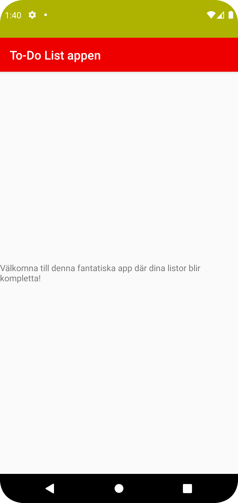

# Rapport

**Skriv din rapport här!**
Dem tre olika ändringarna som har gjorts på appen är följande, Bytte appnamn, bytte texten från hello world till min egna text. samt ändrade färgen på appen.


## Följande grundsyn gäller dugga-svar:


```
Ändring 1
<resources>
    <string name="app_name">To-Do List appen</string>
</resources>

Ändring 2 
 android:text="Välkomna till denna fantatiska app där dina listor blir kompletta!"
 
 Ändring 3 
 <?xml version="1.0" encoding="utf-8"?>
<resources>
    <color name="colorPrimary">#EE0000</color>
    <color name="colorPrimaryDark">#ADB300</color>
    <color name="colorAccent">#03DAC5</color>
</resources>

Dessa är dem tre olika ändringarna. 

```

Bilder läggs i samma mapp som markdown-filen.



Läs gärna:

- Boulos, M.N.K., Warren, J., Gong, J. & Yue, P. (2010) Web GIS in practice VIII: HTML5 and the canvas element for interactive online mapping. International journal of health geographics 9, 14. Shin, Y. &
- Wunsche, B.C. (2013) A smartphone-based golf simulation exercise game for supporting arthritis patients. 2013 28th International Conference of Image and Vision Computing New Zealand (IVCNZ), IEEE, pp. 459–464.
- Wohlin, C., Runeson, P., Höst, M., Ohlsson, M.C., Regnell, B., Wesslén, A. (2012) Experimentation in Software Engineering, Berlin, Heidelberg: Springer Berlin Heidelberg.
